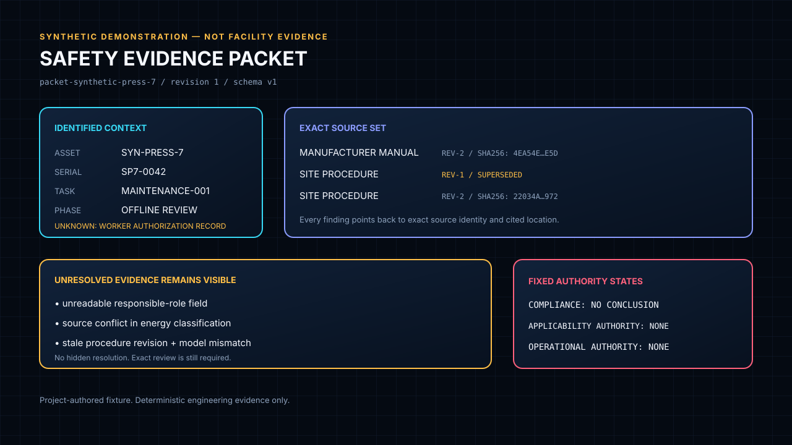

# Oscillink Safety Ops

## Compliance evidence for the physical-intelligence era

**Oscillink builds governed compliance-evidence infrastructure for physical intelligence.**

As physical intelligence moves from research and pilots toward real-world operations, Oscillink
helps teams make the surrounding regulations, procedures, asset context, reviews, and operational
evidence inspectable and traceable.

Safety Ops is the first concrete product: a local, read-only evidence sidecar that binds exact
sources, external review decisions, explicit unknowns, and offline evaluation findings into
reviewable artifacts.

> **Current status:** experimental private product with implemented deterministic contracts. The
> code makes no legal, compliance, certification, safe-operation, work-authorization, deployment,
> practitioner-validation, or production-readiness claim.



*Project-authored synthetic demonstration. It is not facility, customer, legal, or operational
evidence.*

## Make the evidence inspectable

Physical-intelligence plans and recordings do not carry the authority needed to establish what
rules apply, whether a procedure is current, whether evidence is missing, or who reviewed a
decision. Safety Ops keeps those questions explicit.

Given an identified asset, task, and bounded source set, the current contract surface can:

- verify exact local source bytes, revisions, locations, and SHA-256 identities;
- preserve asset, model, serial, site, task, role, and observation context;
- separate untrusted extraction candidates from external human review;
- expose stale, conflicting, missing, ambiguous, unreadable, and unsupported evidence;
- retain corrections, retractions, supersession, and review lineage;
- assemble a versioned Safety Evidence Packet; and
- evaluate proposed plans and recorded episodes offline as cited evidence findings.

Unknown evidence stays unknown. Reviews do not silently carry onto changed bytes or revisions.

## How it works


Source bytes, extraction candidates, normalization, review decisions, and evaluation outcomes stay
separate. Every transformation retains exact identity. No arrow reaches equipment control.

## Product state

| Implemented and tested locally | In validation | Not claimed |
|---|---|---|
| Physical Intelligence Evidence Envelope | Broader official-publication parser coverage | Legal correctness or regulatory applicability |
| Safety Evidence Packet v1 | Qualified-practitioner workflow fit | Compliance determination or certification |
| Exact-byte and source-revision verification | Sanitized real-work example bundles | Safe operation or work authorization |
| Official-source regulatory reconciliation contracts | Additional read-only operational adapters | Production readiness or customer outcomes |
| Federal Register and LSA source-change lineage | Independent hidden-evaluation scoring | Incident prevention or commercial traction |
| Metadata-only licensed-standard registry | Hosted CI for local-only maturation commits | Equipment, PLC, interlock, or robot control |
| Read-only operational JSONL evidence | Legal, engineering, and OT-owner review | Automatic conflict resolution or policy promotion |
| Offline plan and episode evaluation | Public release and publication audit | Autonomous approval of model-generated constraints |
| Deterministic schemas, fixtures, and hidden-test protocol | | |

Tests establish deterministic software behavior only. They do not establish that a source applies,
that an interpretation is legally correct, or that an operation is safe.

## Quickstart

Python 3.11 and [`uv`](https://docs.astral.sh/uv/) are required. All demonstration inputs are
project-authored and synthetic.

```bash
uv sync --locked --dev
PYTHONPATH= uv run python scripts/verify.py
PYTHONPATH= uv run safety-ops episode-evaluate \
  --packet tests/fixtures/synthetic_press/safety-evidence-packet-v1.json \
  --episode tests/fixtures/synthetic_press/episode.json \
  --envelope tests/fixtures/synthetic_press/episode-envelope.json \
  --root tests/fixtures/synthetic_press
```

The episode report binds exact packet and payload identities and emits closed evidence states. Its
fixed top-level output remains:

```text
evaluation_state       evidence_findings_only
compliance_state       no_conclusion
operational_authority  none
```

See the [step-by-step synthetic demonstration](docs/synthetic-demo.md) for source-envelope, plan,
episode, and operational-evidence commands.

## Evidence and authority boundaries

Safety Ops may emit cited evidence states such as:

- `matched`
- `missing_evidence`
- `asset_mismatch`
- `revision_stale`
- `source_conflict`
- `ambiguous`
- `unreadable`
- `unsupported_interpretation`
- `requires_authorized_review`

It cannot emit or grant:

- a compliance conclusion or legal opinion;
- certification, a work permit, or lockout/tagout authorization;
- approval to operate;
- an automatic resolution among regulations, standards, manuals, SOPs, or plans;
- safety PLC, interlock, emergency-stop, controller, robot, machine, or actuator changes; or
- automatic review carry-forward after source bytes, identity, configuration, or revision changes.

Safety Ops is not a safety-rated control system or a replacement for qualified EHS, legal,
maintenance, integration, or safety-engineering review.

## Evidence domains

### Regulatory evidence

The current reconciliation contract preserves exact GovInfo annual CFR, dated eCFR, Federal
Register, and GovInfo LSA identities. Exact text equality proves deterministic equality only.
Accepted source-change bundles establish reviewed source lineage, not legal meaning or compliance.

### Licensed standards

The current registry stores official metadata and explicit rights states only. It contains no
licensed standard text or derived requirements. Full-text processing stays blocked until lawful
access and compatible storage and processing rights are confirmed.

### Operational and episode evidence

Operational adapters and episode evaluators are offline and read-only. They preserve source identity,
quality, ordering, calibration, missing fields, and parser warnings without filling records or
sending commands back to source systems.

Read the [technical overview](docs/technical-overview.md) for the full implemented contract surface.

## Who this is for

The current audience order is:

1. **Safety, compliance, and assurance leaders** defining evidence and review boundaries.
2. **Physical-intelligence builders and integrators** preparing systems for real-world operations.
3. **Operations, maintenance, and OT owners** evaluating read-only evidence fit and authority limits.
4. **Researchers and evaluators** studying provenance, source reconciliation, and offline assurance.

The repository is not currently positioned as a self-service compliance product for operators or a
replacement for existing CMMS, checklist, document-management, or control systems.

## Verification status

The canonical verifier checks text hygiene, generated schemas, the OSHA source catalog, synthetic
fixtures, Ruff, formatting, strict mypy, package builds, and the full test suite.

Exact-SHA verification has passed on Windows and an independent Linux Buildbox for the current
implemented feature baseline. Hosted CI has not evaluated local-only maturation commits because they
have not been pushed. This is reproducibility evidence, not release, safety, compliance,
applicability, or practitioner-validation evidence.

## Documentation

- [Technical overview](docs/technical-overview.md)
- [Synthetic local demonstration](docs/synthetic-demo.md)
- [Product and authority boundary](docs/product-boundary.md)
- [Execution plan and current gates](docs/execution-plan.md)
- [Hidden evaluation protocol](docs/hidden-evaluation-protocol.md)
- [Practitioner interview protocol](docs/interview-protocol.md)
- [Security policy](SECURITY.md)
- [Contributing](CONTRIBUTING.md)

## License

Oscillink Safety Ops is licensed under the [Apache License 2.0](LICENSE). The license applies to the
project-authored source and documentation unless a file states otherwise. It does not grant rights
to third-party standards, manuals, customer procedures, datasets, model weights, services, or
trademarks.