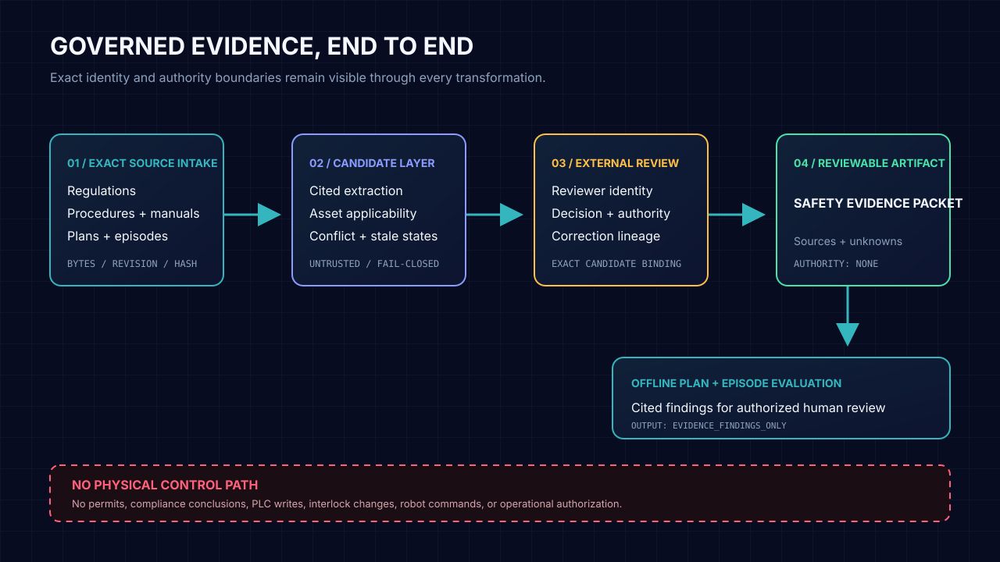

# Technical overview

Oscillink Safety Ops is a local, read-only evidence sidecar for physical-intelligence work. It binds exact source identity, external review decisions, explicit unresolved states, and offline evaluation findings into inspectable artifacts. It does not make compliance decisions or control equipment.

## Implemented contract surface

### Physical Intelligence Evidence Envelope

The provider-neutral [`PhysicalIntelligenceEvidenceEnvelope`](../schemas/physical-intelligence-evidence-envelope.schema.json) binds one exported artifact to:

- exact platform, adapter, version, and adapter-configuration identities;
- portable source and payload references;
- immutable source revision, strictly positive `content_byte_count`, and SHA-256;
- observation time and optional asset, task, run, episode, or simulation identity;
- explicit missing and unsupported fields; and
- fixed `read_only` access and `untrusted_data` treatment.

Unknown fields fail validation. Referenced payloads must remain inside a caller-approved root, must be regular files, must not exceed the configured size bound, and must match their declared bytes and SHA-256.

### Safety Evidence Packet v1

The frozen [`SafetyEvidencePacket`](../schemas/safety-evidence-packet-v1.schema.json) wraps one exact Safety Memory Packet in an identified asset and task context. It preserves:

- jurisdiction, site, asset model, serial, task phase, and role context;
- source class, revision, effective date, exact hash, and applicability metadata;
- externally reviewed constraints with exact citations;
- explicit applicability unknowns;
- unreadable, ambiguous, missing, stale, conflicting, and unsupported evidence;
- correction, retraction, and supersession lineage; and
- fixed interpretation, applicability, compliance, and operational-authority states.

Duplicate and dangling identities fail validation. A constraint-level review does not make the packet a permit, certification, safe-work decision, or approval to act.

The canonical [synthetic packet fixture](../tests/fixtures/synthetic_press/safety-evidence-packet-v1.json) is reproducible through `scripts/generate_packet_fixture.py`.

### Regulatory source evidence

The official-source reconciliation contract requires four exact source roles:

1. GovInfo annual CFR baseline;
2. dated eCFR point-in-time bytes;
3. Federal Register change evidence; and
4. applicable GovInfo List of CFR Sections Affected evidence.

Every artifact carries its official package identity, URL, SHA-256, byte count, citation, and retrieval time. The bounded artifact reader rejects root escape, changed bytes, oversized inputs, DTDs, and entity declarations.

The deterministic comparison states are limited to:

- `verified_match`;
- `explained_official_change`;
- `unresolved_difference`; and
- `missing_evidence`.

Exact text equality establishes deterministic equality only. It does not establish legal equivalence, interpretation, applicability, compliance, or safety. An accepted change bundle records reviewed source lineage only.

The OSHA knowledge catalog contains a point-in-time inventory of 67 indexed parts, including reserved and unavailable entries. Retrieved bytes remain untrusted source evidence.

### Licensed-standard metadata

The [`LicensedStandardRegistry`](../schemas/licensed-standard-registry.schema.json) records official metadata, edition, publication identity, observed supersession, access state, and rights state. It contains no licensed standard text or derived requirements. Full-text processing remains blocked unless lawful access and compatible storage and processing rights are separately confirmed.

### Operational evidence

The provider-neutral JSONL adapter normalizes read-only exports while preserving source tag, timestamp, quality, calibration, exact record hash, and unsupported fields. It reports bounded sequence gaps, duplicates, ordering issues, missing sequence identity, and timestamp ordering without filling or reordering records.

Interpretation candidates bind the exact raw record, rule, interpreter, version, and configuration hash. Their authority remains `candidate` and `no_operational_authority`. External reviews bind the exact candidate hash and keep correction and retraction lineage.

There is no reverse command channel. The adapter cannot acknowledge alarms, reset systems, alter setpoints, write BACnet values, invoke OPC UA methods, command controllers, or mutate a safety PLC.

### Recorded episodes and offline plans

The offline episode evaluator verifies exact local episode bytes, task and asset identity, packet revision, and packet hash. Its output is always `evidence_findings_only`, with `compliance_state = no_conclusion` and `operational_authority = none`.

The plan auditor treats `declared_evidence_keys` only as caller-supplied evidence assertions. A key
does not mean that a requirement is satisfied, an action is proposed, or a condition is safe. Each
finding has one deterministic primary state and an ordered `contributing_states` tuple so stale,
conflicting, unreadable, unsupported, asset-mismatched, and missing conditions can coexist without
being suppressed. Primary-state precedence is: ambiguous, unreadable, source conflict, unsupported
interpretation, stale revision, asset mismatch, then the constraint-kind-specific evidence state.

Constraint-kind-specific states include:

- `matched` and `missing_evidence` for required evidence;
- `prohibited_condition_evidence_present` and
  `prohibited_condition_evidence_not_declared` for prohibited-condition evidence assertions; and
- `requires_authorized_review` for review gates.

A prohibited-condition state reports only whether its evidence key was declared. Presence does not
issue a stop command or safety conclusion; non-declaration does not prove that the condition is
absent. Source and review supersession graphs must be acyclic, and a superseding review cannot
predate the review it supersedes.

These are evidence states for review. They are not instructions, conclusions, or physical actions.

## Storage and integration boundary

Safety Ops keeps source bytes, candidate extraction, normalization, review decisions, and evaluation outcomes separate. Platform adapters are replaceable readers. No provider, OCR model, database, or model framework defines the domain contract.

The package currently exposes Python contracts and an offline CLI. It has no hosted service, control interface, permit workflow, or equipment integration.

## Schemas and reproducibility

Generated JSON Schemas live in [`schemas/`](../schemas/). `scripts/verify.py` checks schema drift, fixtures, formatting, Ruff, strict mypy, package builds, and the full test suite.

The current local maturation commits have been verified on Windows and an independent Linux Buildbox at exact commit SHAs. Hosted CI has not evaluated local-only commits that have not been pushed. Cross-platform checks establish deterministic engineering behavior only.

## Further reading

- [Product and authority boundary](product-boundary.md)
- [Synthetic demonstration](synthetic-demo.md)
- [Execution plan](execution-plan.md)
- [Hidden evaluation protocol](hidden-evaluation-protocol.md)
- [OSHA source catalog](../knowledge/osha/README.md)
- [Security policy](../SECURITY.md)
